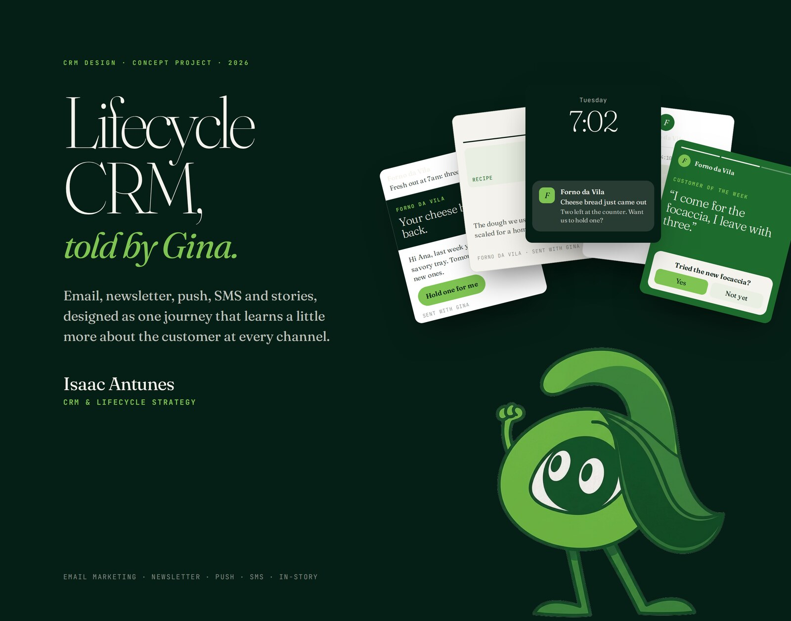
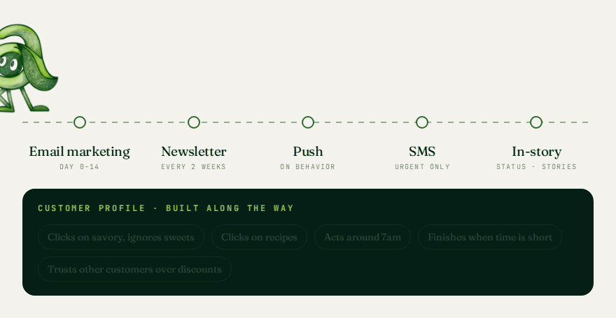
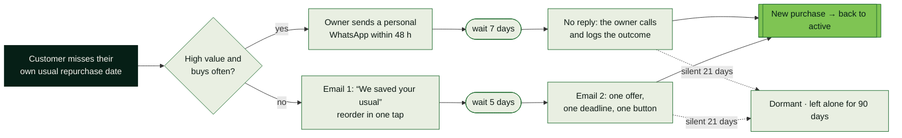

<p align="center">
  <a href="https://isaacantunesfacha-dev.github.io/gina-crm/">
    
  </a>
</p>

<h1 align="center">Gina · Lifecycle CRM</h1>

<p align="center">
  <b>Small businesses don't grow by chasing new customers every morning.<br>They grow when the ones who already came come back.</b>
</p>

<p align="center">
  <a href="https://isaacantunesfacha-dev.github.io/gina-crm/"><b>Open the page</b></a>
  &nbsp;·&nbsp;
  <a href="https://isaacantunesfacha-dev.github.io/gina-crm/demo/"><b>Try the demo</b></a>
  &nbsp;·&nbsp;
  <a href="https://isaacantunesfacha-dev.github.io/gina-crm/pt/">Versão em português</a>
  &nbsp;·&nbsp;
  <a href="https://www.linkedin.com/in/isaacnandes/">Isaac Antunes on LinkedIn</a>
</p>

---

## What is real and what is concept

| | Status |
|---|---|
| The method (lifecycle model, rules, metrics) | My working approach to CRM. The examples that illustrate it use a fictional bakery. |
| The demo | Real code: deterministic rules in the browser, covered by 36 tests (`node --test`). It recommends the next step; it sends nothing. |
| The agent roles on the page | A proposal for how the method could be staffed. Not a running product. |
| Numbers in the examples | Fictional. They show how the method reads data; they are not results. |
| My results in real CRM work | Not on this page. They come from my work at SBT, described on [LinkedIn](https://www.linkedin.com/in/isaacnandes/). |

## Why Gina exists

The idea came from long stretches of running operations and strategy at the same time.
CRM was always the thing that could help and the thing nobody wanted to open.
Gina is how I explain it: a character who walks the customer journey, asks one question
per channel and hands back one decision at a time. The business in the examples changes
with each client. The method doesn't.

Most CRMs get abandoned for the same reason: stages nobody agreed on, data with no owner,
automation built before the process. The software is rarely the problem. The model is.
This repository is the strategy page behind Gina: the method, the journey, the screens and
an honest list of where the method falls short.

## Gina walks one customer through five channels

<p align="center">
  
</p>

Each channel answers one question about the customer. No channel repeats another one's job,
and every answer feeds the same profile. The examples use a fictional bakery; with each client,
the business changes and the journey stays.

| Channel | When | What Gina learns | Behavior principle |
|---|---|---|---|
| **Email marketing** | Day 0–14 | What they open, what they click, which category pulls them back. | Mere exposure, as a hypothesis: three useful emails before one big offer. Test it. |
| **Newsletter** | Every 2 weeks | Which topics they click, and which links they open. | Reciprocity: give something useful before asking for anything. |
| **Push** | On behavior | The hour they act, and how many nudges they tolerate. | Notification budget: two a week, cut on the first dismissal. |
| **SMS** | Urgent only | Whether they need a nudge to finish what they started. | Loss aversion: “your order is held until 6pm.” |
| **In-story** | Status · stories | How they react to new products before they are on sale. | Social proof: real customers, not ads. |

## One journey, written like a contract

The win-back journey starts from each customer's own rhythm, not from a fixed number of days.



A/B test: “your usual” against a discount. Primary KPI: win-back rate.

## Gina, running the method

The [demo](https://isaacantunesfacha-dev.github.io/gina-crm/demo/) turns the rules above into working code.
Paste a list of orders (name, date, amount, or id, name, date, amount) or use the example bakery, and Gina:

- reads each customer's own rhythm: the median days between their orders;
- scores RFV and flags who missed their usual date, who went quiet and who is new;
- picks the next action and channel, drafts the message and names the behavior principle behind it;
- closes with the three-line Monday report: who to contact, who to leave alone, who is fine.

It runs entirely in the browser. No AI model, nothing is sent or stored. The rules live in
[`js/gina.js`](js/gina.js), apart from the interface, so they can be read and checked.

**What the demo does not do.** It recommends the next step; it does not send messages or run the
timed win-back journey above. Before real use, sending needs consent and per-channel preferences
checked in the CRM. Known limits, each covered by a test:

- Without an ID column, customers are matched by name, so two people with the same name are merged.
  "Lucia" and "Lúcia" are two customers.
- RFV thirds are relative to the list. With fewer than three customers, nobody is high value.
- Frequency counts every order; the rhythm counts distinct days. Two orders on the same day are
  two orders but no rhythm yet. Whether that is right depends on the business.
- A line with any field it can't read is skipped and listed, never partly read. Exact repeats are
  kept and flagged. Quoted fields work; a separator inside quotes does not. Refunds (negative
  amounts) are rejected.

## What the page covers

`01` Why CRMs get abandoned, each problem with its answer · `02` A five-step method, tool-agnostic · `03` Lifecycle model with an entry rule per stage ·
`04` The 360° journey · `05` Win-back journey · `06` Mobile-first product screens · `07` **Self-critique** · `08` **Gina Zero**, the same logic for R$0 · `09` Where the bill can get smaller

Every call to action leads to one of two places: the demo or my e-mail.

## Built with

Plain HTML, CSS and JavaScript. No framework, no dependencies, no tracking.

- The hero starts as a still image in the HTML. After the page has loaded, a silent video replaces it
  and loses its paper background live, frame by frame, in a canvas. Phones get a 85 KB pre-cropped copy
  (desktop: 795 KB). With reduced motion, Save-Data, a 2G connection or no JavaScript, the still stays;
  if a device can't key frames fast enough, the still comes back.
- The journey animation is one small script that only runs while it's on screen.
- Reduced motion shows the finished journey. Without JavaScript, the page still reads in full.
- English and Portuguese are written separately, not translated.

<details>
<summary><b>Structure and build</b></summary>

```
index.html, pt/index.html   generated pages (EN, PT)
css/styles.css              tokens and components
js/keyed-video.js           hero video with the background removed live, loaded after the page
js/journey.js               360° journey animation
js/nav.js                   section bar: highlights the section on screen
js/gina.js                  the method as code: rhythm, RFV, status, next action
js/demo.js                  demo interface
js/ref.js                   adds ?ref=behance|linkedin|post|cv to the e-mail subject, nothing else
demo/, pt/demo/             generated demo pages (EN, PT)
404.html                    generated not-found page
assets/                     Gina art (WebP), walk frames, hero video (desktop and phone copies, no audio), link-preview cards (og-en/og-pt.jpg)
src/content/                all copy, one file per language
src/site.mjs                contact, legal text, public URL
src/markup.mjs              shared pieces: channel mocks, phones, win-back flow
build.mjs                   renders both pages from src/
tests/                      rules engine tests (node:test)
docs/                       images for this README
```

Edit `src/`, then run `node build.mjs`. Don't edit the generated HTML by hand.
Run the rules engine tests with `node --test` (Node 20+, no dependencies).
Preview locally with `python3 -m http.server`; opening the file directly keeps the hero as a still image.

</details>

## Work with me

In consulting, I use Gina to map your journey, fix the model and get the first journeys running
on the tool you already have. Start with a 30-minute diagnosis: you leave with the three changes
I'd make first, whether we work together or not.

[iantunessp@gmail.com](mailto:iantunessp@gmail.com?subject=CRM%20diagnosis%20-%20Gina) · [LinkedIn](https://www.linkedin.com/in/isaacnandes/)

## Rights

© 2026 Isaac Antunes. All rights reserved: Gina's name, character and illustrations, the method,
the copy, the design and the code. See [LICENSE](LICENSE).

Concept project. Forno da Vila, Doce Lar Bakery and every customer shown are fictional.
